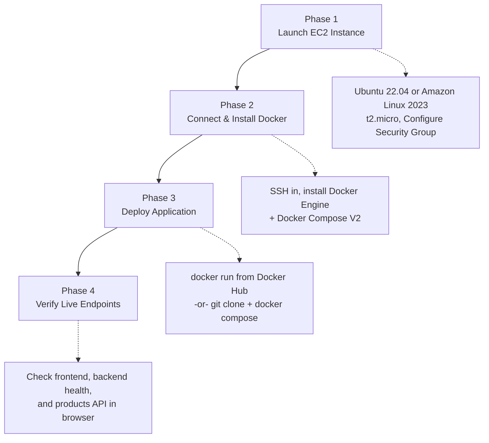

# 🛒 Two-Tier E-Commerce Web Application

A full-stack, containerized **Two-Tier E-Commerce Web Application** built with a **React (Vite)** frontend, an **Express (Node.js)** backend API, and a lightweight file-persisted JSON database. Fully ready for local development, Docker containerization, Docker Hub distribution, and deployment to **AWS EC2**.

---

## 📐 Architecture Overview


**Tiers:**
- **Frontend Tier** — React 18 & Vite, Lucide React icons, responsive CSS.
- **Backend Tier** — Express REST API for product catalogs, orders, and health checks.
- **Database Storage** — Local JSON file store with auto-initialization and volume persistence.

---

## 📂 Repository Structure

```text
.
├── backend/                        # Node.js + Express API server
│   ├── data/                       # Auto-generated JSON database (db.json)
│   ├── src/
│   │   ├── routes/                 # Products and Orders API routes
│   │   ├── db.js                   # Database handler logic
│   │   └── server.js               # Express server entry point
│   └── Dockerfile                  # Standalone Backend Dockerfile
├── frontend/                       # React + Vite application
│   ├── src/                        # React components & API service client
│   └── Dockerfile                  # Standalone Frontend Dockerfile
├── docker-compose.yml               # Multi-container Compose configuration
├── Dockerfile                       # Multi-stage Dockerfile (Single-port build)
├── AWS_DOCKER_DEPLOYMENT_GUIDE.md   # Detailed AWS Deployment Manual
└── package.json                     # Monorepo management scripts
```

---

## 🛠️ Local Development Setup

### Prerequisites
- [Node.js](https://nodejs.org/) (v18+)
- [npm](https://www.npmjs.com/)
- [Git](https://git-scm.com/)

### 1. Clone the Repository
```bash
git clone https://github.com/YOUR_USERNAME/AWS_PROJECT2.git
cd AWS_PROJECT2
```

### 2. Install Dependencies
```bash
npm run install:all
```

### 3. Run Development Server
Starts both Frontend (`http://localhost:3000`) and Backend (`http://localhost:5000`) concurrently:
```bash
npm run dev
```

---

## 🐳 Docker Deployment Options

### Option A — Single-Container / Single-Port Setup (Production)
```bash
# 1. Build the unified Docker image
docker build -t ecom-app:latest .

# 2. Run the single container
docker run -d -p 5000:5000 --name ecom_app ecom-app:latest
```
Access the website at: `http://localhost:5000`

### Option B — Docker Compose
```bash
docker compose up --build -d
```
- **Full App:** `http://localhost:5000`
- **Logs:** `docker compose logs -f`
- **Stop:** `docker compose down`

---

## 📦 Docker Hub — Pull & Run (For Other Users)

The pre-built image is available on Docker Hub: `mihirnayka/two-tier-ecom-app:latest`

### Quick Start with `docker run`
```bash
# ⚠️ The -p 5000:5000 flag is REQUIRED — without it the website won't be accessible!
docker run -d -p 5000:5000 --name ecom_app mihirnayka/two-tier-ecom-app:latest
```
Then open: `http://localhost:5000`

### Quick Start with `docker compose`

Create a `docker-compose.yml` file with this content:
```yaml
services:
  app:
    image: mihirnayka/two-tier-ecom-app:latest
    container_name: ecom_app
    ports:
      - "5000:5000"
    volumes:
      - ecom_data:/app/backend/data
    environment:
      - NODE_ENV=production
    restart: always

volumes:
  ecom_data:
    driver: local
```
Then run:
```bash
docker compose up -d
```

### 🔧 Troubleshooting

| Problem | Cause | Fix |
|---|---|---|
| Website not opening | Port not mapped | Use `-p 5000:5000` in `docker run` |
| `docker-compose` command not found | Docker Compose V1 is deprecated | Use `docker compose` (with space, no hyphen) |
| Container exits immediately | Check logs for errors | Run `docker logs ecom_app` |
| Permission denied on data dir | Linux file permissions | Run `docker run` with `--user $(id -u):$(id -g)` |

### Publishing to Docker Hub
```bash
docker login
docker build -t mihirnayka/two-tier-ecom-app:latest .
docker push mihirnayka/two-tier-ecom-app:latest
```

---

## ☁️ Step-by-Step AWS EC2 Deployment Guide



### Phase 1: Launch AWS EC2 Instance
1. Log in to **AWS Management Console** → **EC2** → **Launch Instance**:
   - **Name:** `ecom-app-server`
   - **AMI:** `Ubuntu 22.04 LTS` **or** `Amazon Linux 2023` (both Free Tier Eligible)
   - **Instance Type:** `t2.micro`
   - **Key Pair:** Select or create a new key pair (`my-key.pem`).
2. **Configure Security Group (Inbound Rules):**

| Type | Protocol | Port Range | Source | Purpose |
|---|---|---|---|---|
| SSH | TCP | `22` | My IP / Anywhere (`0.0.0.0/0`) | Remote Terminal Access |
| Custom TCP | TCP | `5000` | Anywhere (`0.0.0.0/0`) | Full App (Frontend + API) |

---

### Phase 2: Connect & Install Docker on EC2

> **Choose the tab that matches the AMI you selected in Phase 1.**

---

#### 🅰️ Option A — Ubuntu 22.04 LTS

**1. Connect via SSH:**
```bash
chmod 400 my-key.pem
ssh -i my-key.pem ubuntu@<YOUR_EC2_PUBLIC_IP>
```

**2. Install Docker & Docker Compose:**
```bash
sudo apt update && sudo apt upgrade -y
sudo apt install -y docker.io docker-compose-v2
```

**3. Give permissions to your user:**
```bash
sudo usermod -aG docker ubuntu
exit
```

**4. Reconnect SSH for group permission updates to take effect:**
```bash
ssh -i my-key.pem ubuntu@<YOUR_EC2_PUBLIC_IP>
```

---

#### 🅱️ Option B — Amazon Linux 2023

**1. Connect via SSH (from Windows `cmd` or PowerShell):**
```cmd
ssh -i my-key.pem ec2-user@<YOUR_EC2_PUBLIC_IP>
```

**2. Install Docker Engine:**
```bash
sudo yum install -y docker
sudo systemctl start docker
sudo systemctl enable docker
```

**3. Give permissions to your user:**
```bash
sudo usermod -aG docker $USER
```

**4. Download & Configure Docker Compose V2:**

Amazon Linux does not include Docker Compose in its package manager, so download the official release binary directly:
```bash
sudo mkdir -p /usr/libexec/docker/cli-plugins/
sudo curl -SL https://github.com/docker/compose/releases/latest/download/docker-compose-linux-$(uname -m) -o /usr/libexec/docker/cli-plugins/docker-compose
sudo chmod +x /usr/libexec/docker/cli-plugins/docker-compose
```

**5. Refresh the session & verify:**

Disconnect first:
```bash
exit
```

Reconnect from your Windows `cmd` to pick up the new user permissions:
```cmd
ssh -i my-key.pem ec2-user@<YOUR_EC2_PUBLIC_IP>
```

Verify that both Docker and Compose are working:
```bash
docker ps
docker compose version
```

---

### Phase 3: Deploy Application on EC2

**Method 1 — Docker Hub Image (Recommended)**
```bash
docker run -d -p 5000:5000 --name ecom_app mihirnayka/two-tier-ecom-app:latest
```

**Method 2 — Git & Docker Compose**
```bash
git clone https://github.com/YOUR_USERNAME/AWS_PROJECT2.git app
cd app
docker compose up -d
```

### Phase 4: Verification & Live Endpoints
| Endpoint | URL |
|---|---|
| 🌐 Full Application | `http://<YOUR_EC2_PUBLIC_IP>:5000` |
| 🔌 Health Check API | `http://<YOUR_EC2_PUBLIC_IP>:5000/api/health` |
| 📦 Products API | `http://<YOUR_EC2_PUBLIC_IP>:5000/api/products` |

---

## 📡 API Reference Table

| Method | Endpoint | Description |
|---|---|---|
| `GET` | `/api/health` | Health check endpoint |
| `GET` | `/api/products` | Retrieve all products |
| `GET` | `/api/products/:id` | Retrieve product details by ID |
| `POST` | `/api/products` | Add a new product |
| `DELETE` | `/api/products/:id` | Remove a product |
| `GET` | `/api/orders` | Retrieve order history |
| `POST` | `/api/orders` | Submit a new order |

---

## 📜 License

This project is open-source and available under the [MIT License](LICENSE).

